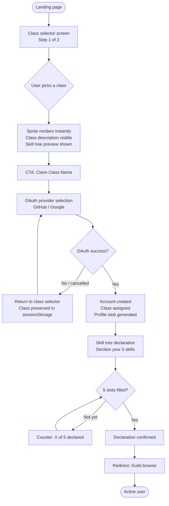
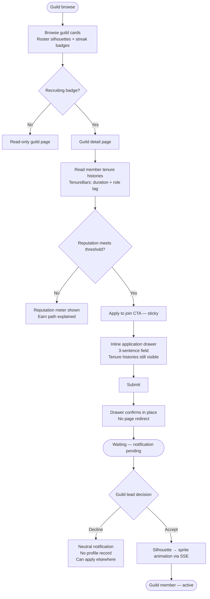
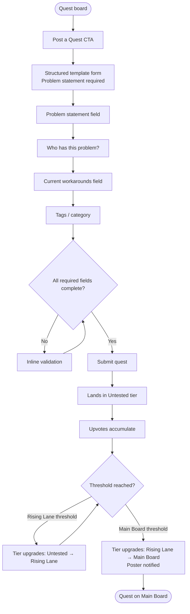
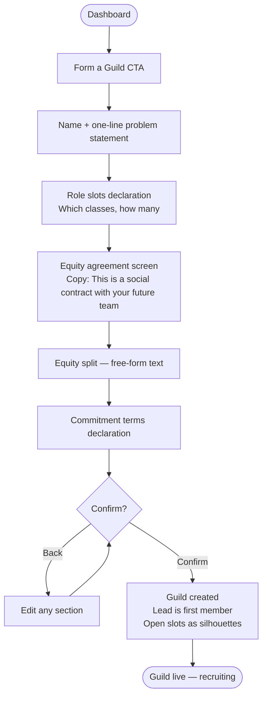
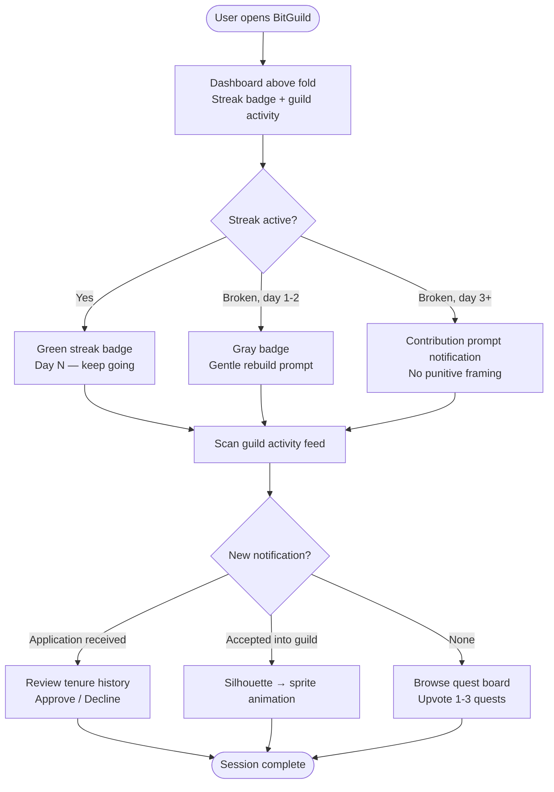

# UX Design Specification — BitGuild

**Author:** Luis
**Date:** 2026-04-30

---

<!-- UX design content will be appended sequentially through collaborative workflow steps -->

## Executive Summary

### Project Vision

BitGuild is accountability infrastructure for software engineers disguised as an RPG guild
platform. The UX must make this distinction clear in the first 60 seconds: this is not
a social network with gaming aesthetics — it is a commitment device with a social contract
built into its visual language. Engineers form guilds, declare classes, post quests, and
ship together. The gritty RotMG pixel-art aesthetic is the product's identity layer, not
decoration. It must be executed with the same precision as the underlying mechanics.

### Target Users

**Maya (Primary — Frustrated Builder):** 22–28, junior-to-mid engineer, multiple unfinished
projects, skeptical of "another platform." Needs to feel respected and competent. The first
60 seconds must signal that this platform is serious about shipping, not networking.

**Daniel (Primary — Senior Engineer):** 35–45, deep technical experience, has seen every
co-founder platform and dismissed them. Logged thousands of hours in MMOs. Immediately
understands guild mechanics. Needs the commitment signal system (tenure history) to feel
like real professional intelligence, not a gimmick.

**Priya (Secondary — Wanderer/PM):** 28–38, product background, has market validation,
needs engineers. The Wanderer class and its constraints must feel like a legitimate role
definition — not a limitation. Her onboarding path is distinct from engineering classes.

**Platform Admin (Operational):** Moderation-focused. Needs a functional flag queue,
reputation audit dashboard, and suspension tools. UI must prioritize efficiency over
aesthetics for this user.

### Key Design Challenges

1. **First 60 seconds are load-bearing** — class selection before account creation is the
   entire first impression. The class selector screen must be visually striking and
   immediately comprehensible in isolation. Users who don't "get it" in 60 seconds will
   not create an account.

2. **Gritty ≠ cute** — The RotMG aesthetic must read as cool to a senior engineer who
   played WoW, not as a children's game. Dark palette, pixel art with weight and detail,
   class sprites that feel earned not cute. The design line between those two readings is
   narrow and must be explicitly maintained across all screens.

3. **Three-tier quest board wayfinding** — Users must always know which tier they're in
   (Untested / Rising Lane / Main Board), why they're there, and what it takes to progress.
   Poor wayfinding turns the quest board's depth into confusion.

4. **Neutral commitment signal display** — Tenure history must display duration and role
   without failure/success labeling. The visual language must read as "transparent and fair"
   not "this platform hides important information."

5. **5-slot constraint as identity** — The skill tree's hard limit must feel intentional
   ("this is your class declaration") not arbitrary ("why can't I add more?"). Copy and
   interaction design carry the distinction.

### Design Opportunities

1. **Class selection as a shareable moment** — A visually striking class selector that works
   before account creation is a zero-cost acquisition loop. Users will screenshot and share
   it before they even sign up if the design is right.

2. **Guild roster with silhouettes as signature visual** — Unfilled slots as gray
   silhouettes with question-mark hats is immediately communicative and visually distinctive.
   A well-executed guild page could become the platform's visual identity.

3. **Commitment signal as data visualization** — Tenure history displayed as a visual
   timeline or card stack (not just a table) could become a signature profile feature that
   users reference and share externally.

4. **Streak as visible commitment signal** — Prominently displayed on profiles, the streak
   counter is both accountability mechanic and quick-scan social proof: "this person shows up."

## Core User Experience

### Defining Experience

The core loop is: identity → guild formation → accountability → shipping. The most
frequent interaction is the **daily return** — user opens BitGuild, checks streak, scans
guild activity, browses quests. This daily habit loop is what the accountability
mechanics are built around.

The most critical interaction is the **guild profile + application flow**: a user reads
the tenure histories of existing members, sees the open role silhouette, and decides
whether to apply. This is where the commitment signal, sprite identity, and accountability
framing converge. If this screen fails, nothing else matters.

### Platform Strategy

- **Platform:** Desktop-first web application; responsive layouts for profile and quest browse flows
- **Input:** Mouse and keyboard primary; no touch optimization required for V1
- **Offline:** Not required
- **Mobile:** Not in scope; desktop developers are the primary audience

### Effortless Interactions

These must require zero conscious effort:
- **Class selection** — 30 seconds, sprite appears immediately, no gates before the aha moment
- **Quest upvoting** — one click, instant visual feedback, rate limit handled silently
- **Guild browsing** — scannable cards with tenure signal visible without clicking into a profile
- **Daily return** — streak counter and guild activity visible above the fold on first load
- **Guild slot application** — 3-sentence application field, submitted directly from the guild page

These carry **intentional friction** (the friction is the feature):
- **Quest posting** — structured template enforces problem-statement quality
- **Guild formation** — equity agreement declaration is a commitment moment, not a checkbox
- **Class change** — class identity feels weighty; not a casual settings toggle

### Critical Success Moments

1. **The sprite appears** — user picks a class, their pixel sprite renders instantly.
   This is the aha moment. It must be fast, visually striking, and feel earned.
2. **First application received** — guild lead reads an applicant's tenure history and
   recognizes a person who ships. The commitment signal system delivered its value.
3. **First application accepted** — member's silhouette slot fills. The guild becomes real.
4. **Quest graduates to main board** — upvote count tips over, tier badge changes visibly.
   Progress is legible.
5. **Guild posts a milestone** — the social contract delivered. The platform recorded it.

### Experience Principles

1. **Identity before everything** — class, sprite, and skill tree declare who you are
   before any other platform action. Users know themselves on BitGuild before they know
   anyone else.

2. **Gritty over polished** — dark palette, pixel art with weight and detail. No SaaS
   rounded-corner friendliness. This is a forge, not a lounge. A 35-year-old with 3,000
   WoW hours must look at it and think "this is cool."

3. **Commitment readable at a glance** — tenure history, streaks, and class badges must
   be scannable in 3 seconds. Not a paragraph of text — a visual signal.

4. **Constraint is the feature** — the 5-slot skill tree limit, Wanderer class constraints,
   and reputation gate are not UX problems to work around. Copy and interaction reinforce
   why each limit exists and why it matters.

5. **Ship bias** — every UI element biases toward action over discussion. Quests require
   a structured problem statement. Guilds require declared roles. Streaks create daily
   pressure. The platform always asks "what did you build today?"

## Desired Emotional Response

### Primary Emotional Goals

The primary emotional ambition of BitGuild is **capable and legitimate** — not as
reassurance, but as structural reality. The platform gives users a team, a commitment,
and a behavioral track record. The emotional product is the shift from isolated builder
to teamed engineer with skin in the game.

Secondary emotional goals by user type:
- **Maya (frustrated builder):** Respected and seen — the platform treats her skills as
  real, her ambition as legitimate, her lack of network as a solvable problem.
- **Daniel (senior engineer):** Calibrated and selective — the commitment signal data
  lets him make real judgments, not rely on gut feeling or connections.
- **Priya (Wanderer):** Legitimate and valued — the Wanderer class makes her role
  explicit and respected, not a workaround for non-engineers.

### Emotional Journey Mapping

| Moment | Target Emotion | Design Driver |
|---|---|---|
| Class selection | Recognition — "this is me" | Sprite renders immediately; class description resonates |
| Skill tree declaration | Ownership | 5 slots feel like a declaration, not a form |
| Browsing guild profiles | Ambition + calibration | Tenure histories enable honest self-selection |
| Applying to a guild | Focused confidence | User knows what they bring; data helps them know where they fit |
| Getting accepted | Accountability + belonging | Being chosen creates obligation to show up |
| Daily return, streak active | Momentum | Streak is green, guild is active, quests are fresh |
| Streak break | Honest accountability, not shame | Neutral notification; clear path back; no punitive framing |
| Guild ships | Pride + vindication | The social contract delivered on its promise |

### Micro-Emotions

**Critical micro-emotions to design for:**
- **Confidence, not anxiety** when applying to a guild — commitment signals let users
  self-select honestly rather than guessing
- **Trust, not skepticism** in other members' histories — behavioral data, not
  self-reported credentials
- **Excitement, not dread** at daily reset — streak counter as forward momentum,
  not a countdown to failure
- **Pride, not embarrassment** when displaying tenure history — no failure labels
  makes the profile a neutral record, not an indictment
- **Belonging, not isolation** — class system creates immediate shared identity
  with other engineers who picked the same class

**Emotions to actively design against:**
- **Judgment** — tenure history must never feel like a report card on past failures
- **Intimidation** — the gritty aesthetic must attract, not repel; new users must
  feel invited into the world, not tested
- **Infantilization** — gamification must feel sophisticated to a 35-year-old senior
  engineer; not a badge-collection app
- **Performance anxiety** — streak mechanics must feel like momentum, never a threat

### Design Implications

- **Recognition → sprite quality is non-negotiable.** Class sprites must be detailed,
  distinct, and feel earned. Picking Backend Warrior must feel like selecting a character
  in a game you respect — not choosing from a dropdown avatar picker.

- **Accountability → guild formation is ceremonial, not administrative.** The equity
  agreement screen is a moment, not a form. Copy: "You're declaring a social contract
  with your team" — not "Please complete the equity split field."

- **Momentum → streak is always forward-looking.** Active streak: green, prominent,
  positive. Broken streak: neutral grey, contribution prompt, clear path back.
  No red. No alarm. No shame spiral.

- **Trust → tenure data is behavioral, not scored.** Duration bars, role tags,
  timeline visualization — not points, grades, or completion percentages. The user
  reads the data and draws their own conclusion.

- **Pride → profiles lead with identity, not credentials.** Sprite first, class second,
  streak third. Job history is a distant afterthought. This is not LinkedIn.

### Emotional Design Principles

1. **Ceremonies over forms** — moments that matter (guild formation, class selection,
   milestone posting) should feel ceremonial. The design elevates them above the
   everyday UI.

2. **Neutral data, user conclusions** — the platform never tells users what to think
   about a tenure record. It shows the data; users judge for themselves. This is the
   foundation of trust in the commitment signal system.

3. **Momentum over milestones** — the streak system creates daily forward movement.
   Design biases toward continuation, not achievement celebration. The next day matters
   more than the 30-day badge.

4. **Identity is permanent-ish** — class selection carries weight. The UX should convey
   that this is who you are on the platform, not a preference you toggle. This
   permanence creates pride in the choice.

5. **Shame-free accountability** — the platform holds users accountable through visible
   data (streak breaks, open silhouette slots, tenure records) without labeling
   outcomes as failures. Accountability without judgment is the design brief.

## UX Pattern Analysis & Inspiration

### Inspiring Products Analysis

**1. Realm of the Mad God (RotMG) — Aesthetic & Identity Reference**

The explicit visual reference. What it does well from a UX perspective:
- **Immediate action before onboarding** — you pick your class and you're in the world.
  No tutorial gate. Character identity is established before any instruction.
- **Visible class identity at all times** — your sprite IS your identity; other players
  read your class in 0.5 seconds from across the screen.
- **Community visibility of stakes** — deaths are visible to everyone; success is worn
  on your sprite (gear quality). Transparent behavioral outcomes without labels.

*Adopt:* Immediate identity establishment before account gates. Class as always-visible
signal. Transparent behavioral data without narrative framing.

---

**2. GitHub — The Contribution Graph Model**

GitHub's contribution graph is the most influential "accountability visual" in developer
culture. What it does well:
- **Neutral behavioral data, no labels** — green squares say "work happened" without
  judging the quality or type. The user interprets. The platform does not editorialize.
- **Commitment is visible at a glance on every profile** — no one has to read a bio to
  understand if someone is active; the graph tells the story.
- **Longitudinal commitment signal** — one week of commits is different from three years.
  The time dimension is the signal.

*Adopt:* The contribution graph model for tenure history and streak display — neutral
behavioral data presented visually, longitudinal, scannable without reading.

---

**3. Steam Profiles — Identity as Commitment Signal**

Steam player profiles are social proof systems for gaming commitment. What they do well:
- **Hours played = commitment signal** — nobody asked Steam to add this; players
  demanded it because it communicates credibility instantly. "200 hours in Dota" says
  more than any bio.
- **Achievements as proof-of-work** — visible, specific, earned through behavior not
  self-report. Visible to everyone on the profile.
- **Profile = identity card** — the first thing you see about a Steam player is their
  game library, hours, and achievements. Not their job or location.

*Adopt:* Profile-as-identity-card concept. Hours/tenure as the primary credibility signal.
Achievement display for shipped guilds (V2 cosmetics).

---

**4. Duolingo — Streak Mechanics Done Right**

The most studied daily-habit product in consumer software. What it does well:
- **Streak is always visible, always forward-looking** — the flame is green and prominent
  when active. When a streak breaks, the notification is gentle: "Come back today to
  rebuild." No red. No shame. Clear path forward.
- **Celebration is proportional** — milestone streaks get celebration, but the next day
  is always the point.

*Adopt:* Forward-looking streak display. Gentle break notifications. No red/alarm
framing for streak breaks. The day after a break is a recovery opportunity, not a
punishment moment.

*Adapt:* BitGuild doesn't need a streak freeze mechanic in V1 — the contribution prompt on
day 3 of a streak break serves the same emotional function with less complexity.

---

**5. Linear — Developer Tool Speed Standard**

Linear is the benchmark for how fast a developer-facing tool should feel. What it does well:
- **Every interaction is instant** — no loading spinners on navigation. Optimistic UI
  everywhere. Developer audience has zero patience for perceived slowness.
- **Keyboard-first** — power users never need to touch the mouse.
- **Information density without clutter** — lots of data visible, tight visual hierarchy.

*Adopt:* Speed as a non-negotiable. Quest board and guild browsing must feel instant.

---

**6. Hacker News — Reputation-Gated Content**

The simplest working reputation gate on the web. What it does well:
- **Karma threshold gates posting** — visible, consequential, the path to earning is clear.
- **Community self-moderation at scale** — flagging and karma combine to handle moderation
  without constant admin intervention.

*Adopt:* The reputation gate model — simple, visible, consequential. Rising Lane is
BitGuild's version of HN's new-account visibility throttle.

---

### Anti-Patterns to Avoid

**LinkedIn endorsements — self-reported skills, no behavioral data**
Social pressure creates meaningless endorsements. BitGuild's skill tree is declared, not
endorsed — and tenure history shows behavioral proof, not claims.

**Polywork's passive engagement model**
No forcing function, no accountability mechanic, no reason to return daily. Became a
broadcast tool rather than a collaboration engine. Shut down January 2025. BitGuild's guild
mechanics and streak system are the explicit counter-design.

**Discord's chaotic first experience**
No identity, no role declaration on join. BitGuild reverses this: identity before community.
You know who you are before you see anyone else.

**Notion's blank slate problem**
Too many options at the start. BitGuild's onboarding is the opposite — one unavoidable
decision (pick your class) before any other action is possible.

**GitHub profile as professional identity**
Contribution graphs are noisy and context-free for collaboration intent. BitGuild's
commitment signal is designed from scratch to show collaboration behavior, not code
output volume.

---

### Design Inspiration Strategy

**Adopt directly:**
- GitHub contribution graph model → tenure history + streak visualization
- RotMG class identity immediacy → class selection before any other action
- Steam profile structure → profile as identity card, tenure as credibility signal
- HN karma gate → reputation gate + Rising Lane model
- Duolingo streak philosophy → forward-looking, shame-free streak mechanics
- Linear speed standard → every interaction feels instant for a developer audience

**Adapt for BitGuild's context:**
- RotMG gritty pixel art → applied to a professional platform; sprites read as identity
  not game characters; dark aesthetic must stay professional-adjacent
- Steam hours-played signal → translated to guild tenure duration bars (behavioral,
  longitudinal, neutral)
- Duolingo streak freeze → simplified to contribution prompt on day 3

**Avoid entirely:**
- LinkedIn self-reported skill endorsements → behavioral data only on BitGuild
- Polywork passive broadcast mechanics → every mechanic on BitGuild has a forcing function
- Discord's identity-free onboarding → identity established before community access
- Notion blank slate → single forced first decision before any other UI

## Design System Foundation

### System Choice: Tailwind CSS + shadcn/ui

Confirmed from architecture. No additional system introduced. The design system's job is to
enforce the gritty identity across every surface, not provide a generic component library.

**Rationale:** shadcn/ui gives us unstyled, composable primitives we fully own. We skin
them to the RotMG palette. The result looks nothing like a generic shadcn app. Tailwind
ensures dark-native consistency without CSS drift across components.

**Dark-native only.** No light mode toggle in V1. The dark palette is the aesthetic — a
light mode is not a constraint we solve, it is a feature we deliberately omit.

---

### Color Palette

All tokens set as CSS variables in `globals.css`. Referenced via Tailwind's arbitrary value
syntax or extended config. No hardcoded hex values in component files.

| Token | Value | Role |
|---|---|---|
| `--background` | `#0d0f14` | Page background — near-black, cool undertone |
| `--surface` | `#151820` | Card / panel backgrounds |
| `--border` | `#2a2d3a` | Dividers, input borders |
| `--primary` | `#c8a862` | Amber/gold — CTAs, class badges, active states |
| `--secondary` | `#4a9b8e` | Teal — secondary actions, tier badges |
| `--danger` | `#8b3a3a` | Muted red — destructive actions only (never streaks) |
| `--success` | `#4a7c59` | Muted green — active streaks, milestone badges |
| `--text-primary` | `#e8e2d9` | Body text — warm off-white |
| `--text-secondary` | `#8a8fa3` | Labels, metadata, timestamps |

**Amber/gold (`--primary`)** is the platform's signature color. It appears on: class sprites
(highlight layer), skill tree declarations, primary CTA buttons, streak counter (active),
reputation meter fill.

**Teal (`--secondary`)** distinguishes tier and system status signals from identity signals.
Quest tier badges, Rising Lane indicators, system tooltips.

**No pure white. No pure black.** All surfaces have slight warmth or cool undertone. Pure
white reads as SaaS; pure black reads as void. Neither is RotMG.

---

### Typography

```css
/* Body — Geist (system-feel, developer-adjacent) */
--font-body: 'Geist', 'Inter', system-ui, sans-serif;

/* Mono — Geist Mono (code, IDs, quest numbers) */
--font-mono: 'Geist Mono', 'Fira Code', monospace;

/* Pixel — Press Start 2P (class identity labels ONLY) */
--font-pixel: 'Press Start 2P', monospace;
```

**Press Start 2P** is used in exactly one context: the class identity label beneath a
sprite (e.g., "BACKEND WARRIOR"). Nowhere else. Overusing the pixel font makes it
precious; one use makes it an identity signal.

**Type scale (Tailwind):**

| Use | Class | Size |
|---|---|---|
| Class identity label | `text-pixel` (custom) | 8px |
| Metadata / timestamps | `text-xs` | 12px |
| Body / quest descriptions | `text-sm` | 14px |
| Card headings | `text-base` | 16px |
| Section headings | `text-lg` | 18px |
| Page headings | `text-2xl` | 24px |

No heading larger than `text-2xl` in the application. Hierarchy comes from weight and
color, not size. This keeps the UI dense and developer-appropriate.

---

### Spacing & Density

Reference: **Linear's information density**, not Notion's breathing room.

- Base unit: 4px (`p-1` in Tailwind)
- Card padding: 16px (`p-4`)
- Section gaps: 24px (`gap-6`)
- Page gutters: 24px at `md`, 32px at `xl`
- No full-bleed padding on desktop — max-width `1280px`, centered

Quest board and guild cards maximize information per viewport. Users should see 4–6 guild
cards or 8–12 quest titles without scrolling at 1280px. Dense, not cluttered.

---

### Custom Components

These 7 components are not in shadcn/ui and must be built from scratch. Each has a defined
visual contract.

| Component | Description | Key Visual Rules |
|---|---|---|
| `AvatarSprite` | Class sprite PNG at 32×32, 64×64, 128×128 sizes | Pixel-crisp (no antialiasing), amber highlight ring on hover, grayscale when inactive |
| `GuildSlot` | Filled (sprite) or empty (silhouette) guild roster slot | Empty = gray silhouette PNG + "?" hat, filled = member sprite + name + class badge |
| `TenureBar` | Horizontal duration bar + role tag for tenure records | Width = proportional to duration (capped at 24 months = 100%), no failure/success label |
| `StreakBadge` | Streak count with flame icon, color-coded | Active = amber, >30 days = gold glow, broken = gray, no red ever |
| `QuestTierBadge` | Pill badge for Untested / Rising Lane / Main Board | Untested = muted gray, Rising Lane = teal, Main Board = amber |
| `ClassBadge` | Compact class identifier (sprite icon + class name) | Used in guild cards, application cards — never full sprite, always pixel-crisp |
| `ReputationMeter` | Horizontal fill meter showing reputation toward threshold | Amber fill, gray track, percentage label, threshold line marker |

All 7 are built as shadcn/ui-style composable primitives: unstyled base + variant props.
No magic defaults that force layout decisions on consumers.

---

### Component Visual Contract: Key Details

**AvatarSprite sizing:**
- `size="sm"` → 32×32 (guild cards, application rows)
- `size="md"` → 64×64 (profile header, quest author)
- `size="lg"` → 128×128 (class selection screen, guild lead display)

**GuildSlot empty state:** The silhouette PNG is a generic humanoid figure with a
question-mark adventurer's hat. Not an avatar placeholder — a deliberate design choice
that communicates "role waiting to be filled" rather than "content loading."

**TenureBar time mapping:**
- 0–3 months: narrow bar (≤25%)
- 3–12 months: medium bar (25–75%)
- 12–24 months: full or near-full bar
- >24 months: capped at 100% width, duration shown as text label

**StreakBadge states:**
- 0-day streak: hidden (no badge rendered)
- 1–29 days: amber flame, count label
- 30+ days: gold glow + flame, count label
- Broken: gray flame icon, "Resume streak" micro-copy, no count

---

### Implementation Notes

```css
/* globals.css — token definitions */
:root {
  --background:     #0d0f14;
  --surface:        #151820;
  --border:         #2a2d3a;
  --primary:        #c8a862;
  --secondary:      #4a9b8e;
  --danger:         #8b3a3a;
  --success:        #4a7c59;
  --text-primary:   #e8e2d9;
  --text-secondary: #8a8fa3;
}
```

```js
// tailwind.config.ts — extend with tokens
theme: {
  extend: {
    colors: {
      background: 'var(--background)',
      surface: 'var(--surface)',
      border: 'var(--border)',
      primary: 'var(--primary)',
      secondary: 'var(--secondary)',
      danger: 'var(--danger)',
      success: 'var(--success)',
    },
    fontFamily: {
      pixel: ['"Press Start 2P"', 'monospace'],
    },
  },
}
```

**Pixel art rendering:** All sprite PNGs must render crisp, never blurred. Apply
`image-rendering: pixelated` to all `AvatarSprite` and `GuildSlot` `` elements.
Never use CSS `filter: blur()` or CSS scaling that smooths pixel edges.

## Defining Core Experience

### 2.1 Defining Experience

BitGuild's defining interaction: **"I found a guild where I fit — and I can prove I belong."**

A user lands on a guild page. They read the tenure histories of three current members — not
bios, not LinkedIn — duration bars and role tags. They see an open silhouette slot. They
write three sentences and apply. This sequence — browse → read commitment signals → apply
— is what BitGuild does that nothing else does. It is where all the mechanics converge.

In one sentence: "GitHub contribution graph meets MMO guild recruitment, for engineers who
want to ship."

### 2.2 User Mental Model

**How users currently solve this problem:**
- Cold DMs on Twitter/LinkedIn — low signal, high friction, often ignored
- Discord servers — chaotic, no structure, no commitment context
- YC co-founder matching — exclusive, linear, slow
- Polywork / Peerlist — passive profiles, no forcing function (Polywork shut down Jan 2025)

**Mental models users bring to BitGuild:**

| Model | Source | How BitGuild leverages it |
|---|---|---|
| Guilds, classes, roles | MMO gaming (WoW, RotMG) | Immediately recognizable structure; no onboarding needed for the core metaphor |
| Contribution graph as truth | GitHub | Behavioral data is trusted; duration bars read as "proof of work" |
| Profile = identity card | Steam | Profile leads with sprite and class, not job title or bio |
| Skepticism of self-reported skills | LinkedIn | Tenure history without endorsements is a relief, not a missing feature |

**Where users expect confusion (requires explicit copy):**
- Tier system — why am I in Untested? How do I advance?
- Wanderer class constraints — do PMs actually belong here?
- Tenure history with no outcome labels — what does this data mean? (intentional; tooltip guides first view)
- Guild equity agreement — is this a legal contract? (copy: "social contract, not legal document")

### 2.3 Success Criteria

The core interaction succeeds when:

1. **Reading a tenure history takes < 10 seconds** — TenureBar + role tag scannable without
   reading prose. One visual pass = one judgment formed.

2. **The application feels consequential, not casual** — 3 sentences is low effort but
   framing ("you're declaring intent to a team") makes it deliberate. Submit button copy matters.

3. **Silhouette-to-sprite transition is visible and satisfying** — accepted application
   animates slot from silhouette to member sprite in real time (SSE). This is a UI moment,
   not a notification.

4. **The applicant leaves knowing where they stand** — "Application submitted. [Guild lead]
   will review your tenure history and respond." No ambiguity.

5. **Guild leads can act within 60 seconds** — review tenure history, approve/decline, done.
   No multi-step admin workflow.

### 2.4 Novel UX Patterns

| Pattern | Why it's novel | Teaching mechanism |
|---|---|---|
| Tenure history with no outcome labels | Users expect "pass/fail" context | Tooltip on first view: "Duration and role — you decide what it means." |
| 3-tier quest board (Untested → Rising Lane → Main Board) | Progression gate invisible to new users | Persistent tier badge + threshold tooltip on all tier displays |
| Class-before-account OAuth flow | Auth usually precedes any identity action | Progress indicator: "Step 1 of 2 — pick your class. Step 2 — create your account." |
| Guild equity agreement as ceremony | Users expect a checkbox | Copy: "This is a social contract, not a legal document. It's how your team agrees to treat each other." |
| Wanderer class constraints | Non-engineers unsure if they belong | Class description names the use case explicitly: "You have a product idea. You need engineers." |

**Established patterns reused directly:** job board application flow, social profile browsing
(card-based, scannable), notification inbox. No user education needed for these surfaces.

### 2.5 Experience Mechanics

**Core flow — Guild Discovery → Application:**

**1. Initiation**
- User arrives via quest board or "Guilds" navigation
- Guild cards: guild name, 2–3 member sprites, open silhouettes, recruiting badge if slots open
- "Recruiting" badge draws attention without requiring a filter step

**2. Interaction**
- Guild card click → guild detail page
- Above fold: guild name, full roster (sprites + silhouettes), active quest, streak bar
- Below fold: tenure histories of all members (TenureBar + role tag + duration for each)
- Sticky CTA if open slots exist: "Apply to join — [open role name]"
- CTA click → inline application drawer (no page navigation): 3-sentence field + submit
- Submit → drawer confirms in place, no page redirect

**3. Feedback**
- Submitted: drawer copy → "Application sent. [Guild lead name] will review your tenure history."
- Guild lead: notification in inbox → opens applicant full tenure history, sprite, class badge, skill tree
- Approved: slot animates silhouette → sprite (real time via SSE, visible to all guild members)
- Declined: applicant receives neutral notification: "Your application to [Guild] wasn't accepted this time."

**4. Completion**
- Accepted: applicant profile shows guild membership; guild roster shows their sprite
- Declined: no permanent record on applicant profile; can apply to other guilds immediately
- Guild lead confirmation: "[Name] joined the guild. Their silhouette is now filled."

**Speed contract:** Application submission → guild lead notification: < 1 second.
Approval → silhouette-to-sprite animation: < 500ms. This moment is the platform's promise
delivering; it must feel instant.

## Visual Design Foundation

### Color System

All color decisions confirmed from Design System Foundation (Step 6). WCAG 2.1 AA compliance
verified across all primary text/background pairs.

**Contrast audit summary:**

| Pairing | Ratio | Status |
|---|---|---|
| `text-primary` (#e8e2d9) on `background` (#0d0f14) | ~15.8:1 | ✅ AAA |
| `text-primary` on `surface` (#151820) | ~12.1:1 | ✅ AAA |
| `text-secondary` (#8a8fa3) on `background` | ~6.2:1 | ✅ AA |
| `text-secondary` on `surface` | ~4.9:1 | ✅ AA (≥14px only) |
| `primary` (#c8a862) on `background` | ~9.2:1 | ✅ AAA |
| `secondary` (#4a9b8e) on `background` | ~5.1:1 | ✅ AA |
| `success` (#4a7c59) on `background` | ~4.6:1 | ✅ AA |

**Color-independence rule:** Information is never conveyed by color alone. All state changes
(streak active/broken, quest tier, tenure duration) pair color with icon, text label, or
visual shape — colorblind users retain full information fidelity.

### Typography System

**Font stack:**
- Body: Geist → Inter → system-ui (Next.js font optimization, zero FOUT)
- Mono: Geist Mono → Fira Code (code blocks, cuid2 IDs, quest numbers)
- Pixel: Press Start 2P (class identity label only — one use, maximum impact)

**Type scale:**

| Level | Size | Weight | Use |
|---|---|---|---|
| Class label (pixel) | 8px | 400 | Class identity label beneath sprite |
| Caption | 12px | 400 | Timestamps, sub-labels |
| Body | 14px | 400 | Quest descriptions, profile bios |
| Body strong | 14px | 500 | Card titles, list items |
| Subheading | 16px | 600 | Card section headers |
| Heading | 18px | 700 | Page section headings |
| Display | 24px | 700 | Page titles, class name on selection screen |

Maximum heading: `text-2xl` (24px). Hierarchy via weight and color, not size.

### Spacing & Layout Foundation

**Grid:** 12-column, `max-w-[1280px]`, centered, `px-6` gutters at `md+`.

**Breakpoints (BitGuild usage):**

| Breakpoint | Width | Usage |
|---|---|---|
| `md` (768px) | Tablet | Quest browse + profile responsive layouts |
| `lg` (1024px) | Desktop | Primary design target |
| `xl` (1280px) | Full desktop | Container max-width clamp |

No `sm` breakpoint targeted in V1. Desktop-first throughout.

**Spatial rhythm:** 4px base unit. Card padding 16px. Section gaps 24px. Page sections 32px.

**Content grids:**
- Quest board: 1col at `md`, 2col at `lg`, 3col at `xl`
- Guild browse: 2col at `md`, 3col at `lg+`

### Accessibility Considerations

- **Focus:** 2px amber (`--primary`) focus ring on all interactive elements via `focus-visible:ring-2 focus-visible:ring-primary`
- **Touch/click targets:** 44×44px minimum for all interactive elements, even desktop
- **ARIA landmarks:** `<main>`, `<nav>`, `<section aria-label>` required on all pages
- **Form labels:** All inputs have visible `<label>` elements; no placeholder-only labeling
- **Reduced motion:** All CSS transitions wrapped in `@media (prefers-reduced-motion: reduce)` overrides
- **Keyboard navigation:** Class selector fully keyboard-navigable (arrows + Enter); guild application drawer traps focus while open

## Design Direction Decision

### Design Directions Explored

The RotMG aesthetic requirement makes this singular. The Dark Forge direction is the product
identity, not one option among several. The HTML showcase (`ux-design-directions.html`)
demonstrates this direction across 5 key screens and a component reference panel.

Showcase URL: `_bmad-output/planning-artifacts/ux-design-directions.html`

### Chosen Direction: Dark Forge

Single cohesive visual direction applying the gritty dark palette, pixel sprite system, and
dense developer-appropriate layout across all surfaces.

### Design Rationale

**Amber/gold as signature color** — `#c8a862` reads as a coherent identity signal across
CTAs, active streaks, and class identity labels. Not decorative; functional and recognizable.

**Silhouettes communicate immediately** — the `GuildSlot` empty state (gray humanoid + "?"
hat) is legible at a glance on guild browse cards without tooltip or explanation.

**Tenure bars are scannable** — duration-proportional bars + role label + duration text in
one horizontal row. Two members' histories comparable in < 5 seconds.

**Inline application drawer** — applying from the guild page without page redirect keeps
tenure history context visible while writing the application. Removing the navigation break
is the right pattern for maintaining commitment-signal context at the moment of decision.

**Dense layout is appropriate** — quest board, guild browse grid, and profile tenure
timeline all read as "serious developer tool" density. Not a consumer app.

### Implementation Approach

- Start with the `AvatarSprite` and `GuildSlot` components — they appear on every surface
  and define the visual identity
- Build the `TenureBar` and `StreakBadge` next — they are the commitment signal layer
- Quest board and guild browse pages use the same card pattern; build the card once
- The class selection screen is the highest-stakes first impression — build it last when
  all design patterns are proven, and give it extra polish time

## User Journey Flows

### Journey 1: New User Onboarding

Class selection → OAuth → Skill tree declaration → Active profile.
The first 60 seconds are load-bearing. Class selection before account creation is the
make-or-break moment.



**Key constraints:** sessionStorage bridge carries class across OAuth redirect. Skill tree
requires all 5 slots before proceeding — cannot be skipped.

### Journey 2: Guild Discovery and Application

The defining experience. Commitment signal system delivers its value here.



### Journey 3: Quest Posting

Structured intentional friction — template enforces problem-statement quality.



### Journey 4: Guild Formation

Ceremonial, not administrative. Equity agreement is the social contract moment.



**Ceremony note:** Equity agreement screen gets distinct visual treatment — larger text,
more whitespace. "Declare this guild" not "I agree."

### Journey 5: Daily Return Loop

Must deliver value in < 30 seconds for daily returning users.



**Speed contract:** Dashboard loads in < 1s. Streak visible without scroll. Daily loop
completes in 2–5 minutes for engaged users.

### Journey Patterns

**Navigation patterns:**
- Inline drawer over page navigation — application form, quest detail, notifications
- Sticky CTA on guild page — apply button follows scroll until drawer opens

**Decision patterns:**
- Gate → explain → earn: reputation gates always show gap and path forward, never just block
- Ceremony screen for high-stakes commits: equity agreement gets distinct visual treatment
- sessionStorage bridge: pre-auth decisions (class selection) survive OAuth redirect

**Feedback patterns:**
- Optimistic UI: upvote count increments immediately, server reconciles async
- SSE for real-time state: silhouette-to-sprite, guild activity feed
- Neutral break recovery: broken streak → gray (never red), prompt → clear path, no shame

### Flow Optimization Principles

1. **Preserve context across high-friction steps** — tenure histories visible behind application drawer
2. **Gate with a path, never just a gate** — every gate shows current score, threshold, one specific earning action
3. **Ceremony by exception** — equity agreement and class declaration are intentionally slower; all else frictionless
4. **Forward-looking on breaks** — streak copy always looks forward ("rebuild today"), never backward
5. **Real-time for social proof moments** — silhouette-to-sprite is the platform's emotional peak; never requires page refresh

## Component Strategy

### Design System Components (shadcn/ui — use directly)

`Button`, `Input`, `Textarea`, `Card`, `Badge`, `Dialog`/`Sheet`, `Tabs`, `Tooltip`,
`Separator`, `Avatar` (fallback only), `NavigationMenu`, `DropdownMenu`, `Toast`

All shadcn/ui primitives are reskinned with BitGuild's CSS variable tokens. No new component
library introduced. No component overrides needed — token replacement is sufficient.

### Custom Components

7 custom components not available in shadcn/ui. All built on raw HTML + Tailwind +
CSS variables. All export with a `className` prop for consumer overrides.

File location: `src/components/BitGuild/`

#### AvatarSprite

Displays class sprite PNG at 3 sizes (32/64/128px) with pixel-crisp rendering.

**Props:** `src`, `alt`, `size: 'sm'|'md'|'lg'`, `ring?: boolean`, `inactive?: boolean`

**States:** Default → Ring (amber border) → Inactive (grayscale 0.5) → Loading (skeleton) → Error (shadcn Avatar fallback)

**Rule:** `image-rendering: pixelated` always. Never CSS scale that blurs pixel edges.

#### GuildSlot

Filled member slot (sprite + username + class label) or empty slot (silhouette + "?" + role badge).

**Props:** `state: 'filled'|'empty'`, `member?`, `openRole?`, `isLead?`, `size?: 'sm'|'md'`

**Empty hover:** brightens if user is eligible to apply; tooltip if not (explains reputation gate).

#### TenureBar

Proportional duration bar + role label + duration text. Read-only commitment signal display.

**Props:** `role`, `months`, `maxMonths?: 24`, `period?`, `description?`

**Fill mapping:** 0–3mo = ≤12.5%, 3–12mo = 12.5–50%, 12–24mo = 50–100%, >24mo = capped at 100%.

**Accessibility:** `role="img"` with `aria-label="[role], [N] months"`. Bar is presentational.

#### StreakBadge

Active/broken streak counter. The daily accountability signal.

**States:** Hidden (count=0) → Amber (1–29 days) → Gold glow (30–99) → Gold pulse (100+) → Gray/broken

**Hard rule:** No red state. `broken` is gray with "Resume streak" copy, never an alarm.

#### QuestTierBadge

Tier pill with optional tooltip explaining threshold. `tier: 'untested'|'rising'|'main'`

**Colors:** Untested = `text-secondary`/muted bg, Rising Lane = `secondary`/teal bg, Main Board = `primary`/amber bg.

#### ClassBadge

16px sprite icon + class name in class color. Inline reference variant (not full AvatarSprite).

#### ReputationMeter

Horizontal fill meter showing `current / threshold`. Threshold value read from API (`PlatformConfig`), never hardcoded in component.

**States:** Incomplete (amber fill, "X more to unlock") → Complete (full fill + checkmark).

### Component Implementation Roadmap

**Phase 1 — Identity layer (blocks all other screens):**
`AvatarSprite` → `ClassBadge` → `GuildSlot`

**Phase 2 — Commitment signal layer (blocks guild detail, profile):**
`TenureBar` → `StreakBadge` → `ReputationMeter`

**Phase 3 — Quest board layer (can parallel Phase 2):**
`QuestTierBadge`

## UX Consistency Patterns

### Button Hierarchy

| Variant | Use |
|---|---|
| **Primary** | One per view — the main action (Claim Class, Submit Application, Declare Guild) |
| **Outline** | Secondary actions, filters, cancel, back |
| **Ghost** | Tertiary UI (nav items, sorting toggles) |
| **Danger** | Destructive confirm only — always gated behind a confirmation dialog |

Rules: Never two primary buttons in the same view. Cancel is always outline (not ghost).
Destructive actions always require a confirmation dialog before executing.

### Feedback Patterns

**Toast notifications (top-right, shadcn/ui Toast):**

| Event | Copy |
|---|---|
| Application submitted | "Application sent. [Lead] will review your tenure history." |
| Application accepted | "[Guild] accepted you. Your silhouette is now filled." |
| Application declined | "Your application to [Guild] wasn't accepted this time." |
| Streak broken (day 1) | "Streak paused. Post a quest or upvote to rebuild." |
| Guild created | "Guild live. Open slots are now visible to the community." |
| Server error | "Something went wrong — try again in a moment." |

Rules: No "failed" or "rejected" language. No red toasts for streak events.
Auto-dismiss: 4s for success/neutral, 8s for errors.

**Inline validation:** On blur only (not on keystroke). Error text below field in `danger`
color. No success validation checkmarks.

### Form Patterns

- **Quest form:** All fields required, no optional fields. Submit hidden until complete.
- **Guild formation:** Step indicator top-right. Back always available. Forward gated by
  current step completion. Equity step: full-width, larger text, 40% extra vertical padding.
- **Application drawer:** 600-char textarea, "Submit Application" submit label, tenure
  histories visible through backdrop.
- **Skill tree:** Combobox search to add skills. Add button disabled at 5 slots. Counter
  copy when full: "Your class is declared. You can change this later, but it carries weight."

### Navigation Patterns

**Top bar:** `[Logo]  [Quest Board]  [Guilds]  [Profile]  [Notifications]  [User menu]`

Active state: `primary` color bottom border (2px). Notification badge: amber dot.

**Keyboard shortcuts:** `G B` Guild Browse, `G Q` Quest Board, `G P` Profile,
`/` Quest search (quest board only), `Esc` Close drawer/dialog.

### Overlay and Drawer Patterns

- **Application drawer:** Right-side Sheet, focus-trapped, tenure histories visible behind
  backdrop. Unsaved content → "Abandon application?" confirmation before close.
- **Equity agreement:** Full-page step (not a modal). Needs full screen attention.
- **Confirmation dialogs:** State consequences, not questions. "Are you sure?" is forbidden.
  Format: "[Action]. This will [consequence]." Buttons: Cancel (outline) + Confirm-[Action] (danger).

### Empty States

- Quest board: "No quests posted yet. Be the first — post a real problem." + CTA
- Guild browse: "No guilds recruiting right now. Form the first one." + CTA
- Notifications: "Nothing yet. When guild activity happens, it appears here." (no CTA)
- Tenure history (new user): "Your tenure history starts with your first guild. Join one."
- No sad-face illustrations. No "Looks like nothing's here!" Developer-appropriate, direct.

### Loading States

- **Skeleton screens** for all card-based content — shapes match actual content exactly
- **Spinner** for single-item loads (one guild, one profile)
- **Optimistic UI** for upvote, application submit, streak update — failure triggers toast
- No full-page loading screens

### BitGuild-Specific Patterns

**Commitment signal display:** Always labeled "Tenure History." No outcome labels anywhere.
Tooltip: "Duration and role — you decide what it means."

**Streak recovery:** Day 1–2: gray badge + inline prompt (no notification). Day 3+: one
push notification, then silence. Never multiple streak-break messages.

**Tier progression:** Badge pulses once (300ms) on tier change. One in-app notification on
Main Board graduation. Quests never move backward (no tier regression).

**Reputation gate:** Always shown with current score + threshold + delta + one earning
action. Format: "You have 380 reputation. [Guild] requires 500. Post a quest to earn more."
Never: "You don't have enough reputation."

## Responsive Design & Accessibility

### Responsive Strategy

Desktop-first. Explicit product decision — primary audience is engineers at a desk.
No `sm` breakpoint (< 768px) targeted. Mobile Safari/Chrome not tested in V1.

**Responsive surfaces (V1 scope):**

| Surface | Desktop | `md` (768px) |
|---|---|---|
| Quest board | 3-column card grid | 1-column list |
| Guild browse | 3-column card grid | 2-column grid |
| Profile | 2-column (identity + tenure history) | 1-column stacked |
| All other surfaces | Desktop only — no responsive adaptation |

### Breakpoint Strategy

```
md:  768px   — responsive layout changes for quest/guild/profile
lg:  1024px  — primary design target
xl:  1280px  — container max-width clamp
```

No custom breakpoints. No `sm` styles written. Container clamps at `max-w-[1280px]`
centered — on ultrawide, content is centered with empty margins, not stretched.

Write all Tailwind styles mobile-first even for desktop-only surfaces (start with `block`,
add `md:grid-cols-2` etc.) to prevent layout breakage on non-targeted screens.

### Accessibility Strategy

Target: **WCAG 2.1 AA**

**Semantic HTML landmarks required on every page:**
`<header>`, `<main>`, `<nav aria-label>`, `<section aria-label>`, `<footer>` (if present)

**ARIA requirements by component:**

| Component | Required ARIA |
|---|---|
| `AvatarSprite` | `role="img"` + `alt="[username] — [class]"` |
| `GuildSlot` (empty) | `aria-label="Open slot — [role] role"` |
| `TenureBar` | `role="img"` + `aria-label="[role], [N] months"` |
| `StreakBadge` | `aria-label="[N]-day streak, active"` or `"Streak broken — resume today"` |
| `ReputationMeter` | `role="meter"` + `aria-valuenow` + `aria-valuemax` |
| Application drawer | `role="dialog"` + `aria-modal="true"` + `aria-labelledby` |
| Upvote button | `aria-label="Upvote quest: [N] upvotes"` + `aria-pressed` |

**Focus management:**
- Drawer open: focus moves to first interactive element inside
- Drawer close: focus returns to triggering element
- Class selector: `aria-selected` on active card, arrow key navigation between classes

**Skip link** (first element in `<body>`, visible on focus only):
```html
<a href="#main-content" class="sr-only focus:not-sr-only focus:fixed focus:top-2 ...">
  Skip to main content
</a>
```

**Reduced motion:**
All CSS transitions (sprite ring, silhouette→sprite, streak glow, tier badge pulse)
wrapped in `@media (prefers-reduced-motion: reduce)` with `animation: none` overrides.

**Implementation rule:** Interactive custom components must be `<button>` elements (or
`role="button"` + `tabindex="0"` + keyboard handlers). Never `<div onClick>`.

### Testing Strategy

**Automated (CI gate):**
- `axe-core` via `@axe-core/react` in development mode
- `eslint-plugin-jsx-a11y` at lint time

**Manual checklist (per page before release):**
- Keyboard-only navigation (Tab, Shift+Tab, Enter, Space, Esc, arrows)
- All interactive elements show amber focus ring
- Screen reader announces state changes (streak break, slot filled, tier upgrade)
- Application drawer traps focus correctly
- Class selector navigable via arrow keys

**Screen reader testing (pre-launch):**
- NVDA + Chrome (Windows)
- VoiceOver + Safari (macOS)

**Colorblind simulation (pre-launch):**
- Deuteranopia + Protanopia modes via Coblis or browser DevTools
- Verify tier badge, streak state, and reputation gate distinguishable without color

